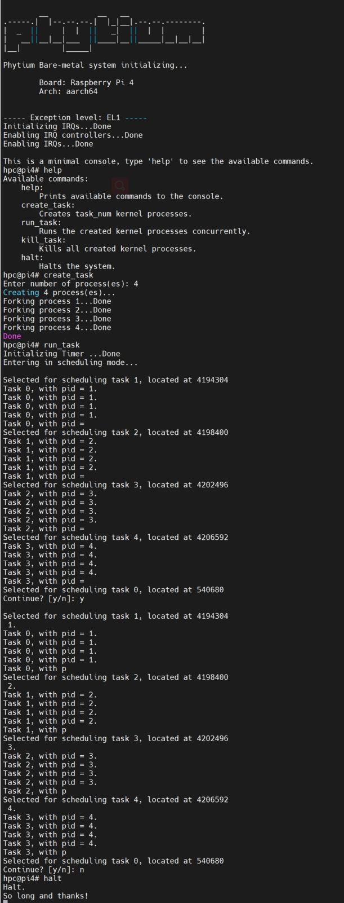

# tinyOS

Minimal ARM Operating System for the Raspberry Pi 4, supporting aarch64 architectures.

## Boards
Support for:
- [x] Raspberry Pi 4

## Features
- [x] Basic Directory Structure
- [x] Register Addresses
    - [x] GPIO
    - [x] AUX
- [x] mini UART
- [x] Kernel printing info on start up
- [x] `printk`
- [x] `string.h` functions
    - [x] `strlen`, `strcmp`, `strcpy`, `strcat`, `strrev`
    - [x] `memset`, `memcpy`
- [x] `stdlib.h` functions
    - [x] `itoa`
    - [x] `atoi`
- [x] `stdbool`
    - [x] `true`, `false`
- [x] Exception Levels (ARMv8-a)
    - [x] `armstub` starts kernel at EL3
    - [x] Kernel starts at EL3
    - [x] Print EL
    - [x] Change from EL3 to EL1
- [x] Interrupts - IRQ
    - [x] Initialize vector table
    - [x] Enable / Disable interrupts
    - [x] IRQ registers
    - [x] Handle mini UART interrupts
    - [x] Handle Timer interrupts
- [x] Timer
    - [x] System Timer 1 init (set interval from param)
    - [x] System Timer 1 handler
    - [x] System Timer 1 stop
    - [x] Sleep (msec)
- [x] GPIO
    - [x] Functions for set/clear pins
    - [x] Function for seting Alt Func to GPIO pins
- [x] Console
    - [x] prompt
    - [x] Take users input
    - [x] Command parser
    - [x] Handle Commands
    - [x] Commands
        - [x] help
        - [x] halt
        - [x] create_procs
        - [x] run_procs
- [x] Processes
    - [x] Scheduler
    - [x] Context Switch
    - [x] Fork
    - [x] Process initialization
    - [x] Parameterize processes:
        - [x] Number
        - [x] Argument
        - [x] Kill process

A screenshots where, we create 4 processes, run them and kill them:

